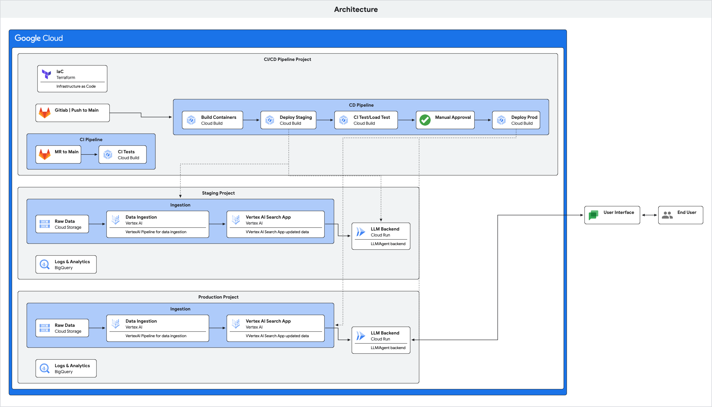

# Agent Builder Search
This pattern extends the GenAI App Starter Pack, introducing a robust data ingestion pipeline for enriching your Retrieval Augmented Generation (RAG) applications. It leverages Vertex AI Search, enabling you to ingest, process, and embed your custom data for improved relevance and context in generated responses.

## Architecture
The pattern implements the following architecture:


The main addition to the base pattern is the addition of the ingestion components. 

### Key Features

* **Vertex AI Search Integration:**  Utilizes Vertex AI Search for efficient data storage and retrieval.
* **Automated Data Ingestion Pipeline:** Automates the process of ingesting data from input sources.
* **Custom Embeddings:** Generates embeddings using Vertex AI Embeddings and incorporates them into your data for enhanced semantic search.
* **Terraform Deployment:** Ingestion pipeline is instantiated with Terraform alongside the rest of the infrastructure of the starter pack.
* **Cloud Build Integration:**  Deployment of ingestion pipelines is added to the CD pipelines of the starter pack.
* **Customizable Code:** Easily adapt and customize the code to fit your specific application needs and data sources.


From an infrastructure point of view, a vertexai agent builder datastore and search app are being initialised in both staging and prod environments. You can learn more about these [here](https://cloud.google.com/generative-ai-app-builder/docs/enterprise-search-introduction).

When a new build is triggered through a commit to the main branch, in addition to updating the backend application, the data ingestion pipeline is also updated. 

The data ingestion is orchestrated through a VertexAI [Pipeline](https://cloud.google.com/vertex-ai/docs/pipelines/introduction) which in its simplest form comprises of a single processing step. During this step, data are being read (in this example we start from a single pdf document) from your preferred location, then the data are being chunked and prepared for ingestion to the agent builder store which is being kicked off. The Search app is automatically updated with the latest data as soon as the data ingestion is complete with zero downtime. 

Please note that the ingestion in the example is set to run automatically once per week. You may change the frequency of the update or  the triggering mechanism altogehter to match your needs. Look into the data_ingestion/pipleine.py file as the starting point for these changes. 


## Getting Started

In order to implement data ingestion for the datastore, you need to replace some of the 
existing files with new ones provided in the resources_to_copy folder

Run the following bash commands to perform all necessary copies. Once completed, follow the remaining instructions from the parent [folders](https://github.com/GoogleCloudPlatform/generative-ai/blob/main/gemini/sample-apps/e2e-gen-ai-app-starter-pack/deployment/README.md). 

```bash

# Add additional substitutions to the build_triggers.tf file
sed -i "$(grep -n "substitutions_cd_pipeline_triggers" deployment/terraform/build_triggers.tf | cut -d: -f1)r app/patterns/agent_builder_search/resources_to_copy/substitutions_cd_pipeline_triggers.tf" deployment/terraform/build_triggers.tf
sed -i "$(grep -n "substitutions_deploy_to_prod_pipeline_triggers" deployment/terraform/build_triggers.tf | cut -d: -f1)r app/patterns/agent_builder_search/resources_to_copy/substitutions_deploy_to_prod_pipeline_triggers.tf" deployment/terraform/build_triggers.tf


# Add new values at the end of several tf files.
cat app/patterns/agent_builder_search/resources_to_copy/additional_iam.tf >> deployment/terraform/iam.tf
cat app/patterns/agent_builder_search/resources_to_copy/additional_service_accounts.tf >> deployment/terraform/service_accounts.tf
cat app/patterns/agent_builder_search/resources_to_copy/additional_storage.tf >> deployment/terraform/storage.tf
cat app/patterns/agent_builder_search/resources_to_copy/additional_variables.tf >> deployment/terraform/variables.tf
cat app/patterns/agent_builder_search/resources_to_copy/additional_env.tfvars >> deployment/terraform/vars/env.tfvars
# TODO: Do we need the same for deployment/terraform/dev ?


# Add new tf files to the deployment folder
mv app/patterns/agent_builder_search/resources_to_copy/main.tf deployment/terraform/main.tf
mv app/patterns/agent_builder_search/resources_to_copy/backend.tf deployment/terraform/backend.tf
mv app/patterns/agent_builder_search/resources_to_copy/data_store.tf deployment/terraform/data_store.tf
# replace tf file with different substitution parameter names
mv app/patterns/agent_builder_search/resources_to_copy/build_triggers.tf deployment/terraform/build_triggers.tf

# replace the old files with the new ones and add the ingestion logic
mv deployment/cd/deploy-to-prod.yaml deployment/cd/unused-deploy-to-prod.yaml
mv deployment/cd/staging.yaml deployment/cd/unused-staging.yaml
mv app/patterns/agent_builder_search/resources_to_copy/deploy-to-prod.yaml deployment/cd/deploy-to-prod.yaml
mv app/patterns/agent_builder_search/resources_to_copy/staging.yaml deployment/cd/staging.yaml
mv app/patterns/agent_builder_search/resources_to_copy/pipeline.py data_ingestion/pipeline.py
mv app/patterns/agent_builder_search/resources_to_copy/ingestion_component.py data_ingestion/ingestion_component.py
```
